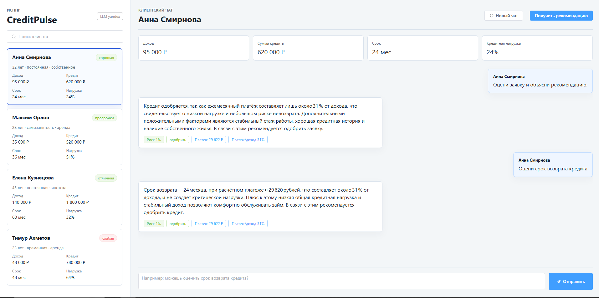

# CreditPulse

CreditPulse — прототип интеллектуальной системы поддержки принятия решений для оценки кредитоспособности заемщика. Проект состоит из двух частей:

- `backend`: FastAPI API, скоринг, интеграция с LLM-провайдером.
- `frontend`: Vue 3 + TypeScript приложение, которое раздается через nginx.

## Демо



## Продакшен-запуск

Продакшен-подобный запуск использует Docker Compose и два контейнера.

Перед первым запуском создайте `.env` на основе `.env.example`:

```bash
copy .env.example .env
```

В PowerShell:

```powershell
Copy-Item .env.example .env
```

После этого откройте `.env` и заполните реальные значения, например `YANDEX_API_KEY`.

```bash
docker compose up -d --build
```

Открыть приложение:

```text
http://127.0.0.1:8000
```

Сервисы:

- `frontend`: nginx, доступен снаружи на `127.0.0.1:8000`
- `backend`: FastAPI, доступен внутри compose как `http://backend:8000`

Полезные адреса через nginx:

```text
http://127.0.0.1:8000/api/health
http://127.0.0.1:8000/docs
http://127.0.0.1:8000/openapi.json
```

## Переменные окружения

`.env.example` — это только пример файла окружения. Реальные секреты нужно хранить в `.env`. Не кладите настоящие ключи в `.env.example`.

Пример `.env`:

```text
CREDITPULSE_LLM_PROVIDER=yandex
YANDEX_API_KEY=<real_key>
YANDEX_BASE_URL=https://ai.api.cloud.yandex.net/v1
YANDEX_PROJECT=b1gea2upudrrrnph3fj4
YANDEX_PROMPT_ID=fvtf6nig20k1irru1ffs
```

Compose сначала читает `.env.example`, затем опциональный `.env`, поэтому значения из `.env` переопределяют шаблон.

Для локального режима без внешнего API:

```text
CREDITPULSE_LLM_PROVIDER=mock
```

## Режим разработки

Для разработки удобнее запускать backend и frontend отдельными процессами.

### Backend

Создайте виртуальное окружение:

```bash
python -m venv .venv
```

Активируйте его.

Windows PowerShell:

```powershell
.\.venv\Scripts\Activate.ps1
```

Windows CMD:

```cmd
.venv\Scripts\activate.bat
```

Linux/macOS:

```bash
source .venv/bin/activate
```

Установите Python-зависимости:

```bash
pip install -r requirements.txt
```

Создайте `.env`, если еще не сделали это:

```bash
copy .env.example .env
```

Заполните `.env` реальными значениями или переключите локальный мок:

```text
CREDITPULSE_LLM_PROVIDER=mock
```

Запустите backend:

```bash
uvicorn app.main:app --reload --host 127.0.0.1 --port 8000
```

### Frontend

Установите npm-зависимости:

```bash
cd frontend
npm install
```

Запустите frontend:

```bash
npm run dev
```

Открыть Vite dev server:

```text
http://127.0.0.1:5173
```

Vite проксирует `/api` и `/openapi.json` на `http://127.0.0.1:8000`.

## Генерация API-клиента

Orval генерирует TypeScript-клиент из OpenAPI-схемы FastAPI:

```text
http://127.0.0.1:8000/openapi.json
```

Перед генерацией должен быть запущен backend.

```bash
cd frontend
npm run generate
```

Сгенерированный клиент лежит в одном файле:

```text
frontend/src/api/generated/creditpulse.ts
```

## Проверки

Frontend:

```bash
cd frontend
npm run typecheck
npm run lint
npm run build:docker
```

Backend:

```bash
python -m compileall app
```

Проверка Docker Compose:

```bash
docker compose config --services
```

## API

`GET /api/health` — статус backend и активный LLM-провайдер.

`GET /api/borrowers` — список карточек заемщиков.

`GET /api/borrowers/{borrower_id}` — карточка одного заемщика.

`POST /api/analyze` — расчет скоринга и генерация объяснения через LLM.

Пример запроса:

```json
{
  "borrowerId": "anna",
  "question": "Оцени заявку и объясни рекомендацию."
}
```

Для обратной совместимости backend также принимает старый формат с полной карточкой `borrower`.

## Архитектура модулей

- `app/scoring.py` — базовый модуль скоринга.
- `app/schemas.py` — Pydantic-схемы API.
- `app/data.py` — демонстрационные заемщики и display-поля.
- `app/llm/base.py` — общий интерфейс LLM-провайдера.
- `app/llm/mock_provider.py` — локальный мок без внешнего API.
- `app/llm/yandex_provider.py` — интеграция с Yandex Cloud AI через OpenAI-compatible API.
- `frontend/src/App.vue` — основной интерфейс.
- `frontend/nginx.conf` — nginx-прокси для frontend и backend API.

## Ограничения прототипа

- История чатов хранится только в памяти frontend и сбрасывается при перезагрузке страницы.
- Скоринг пока является детерминированной демонстрационной эвристикой.
- Демо-заемщики пока хранятся в коде.
- LLM-модуль заменяемый: новый провайдер можно подключить через `app/llm/base.py` и `app/llm/factory.py`.
